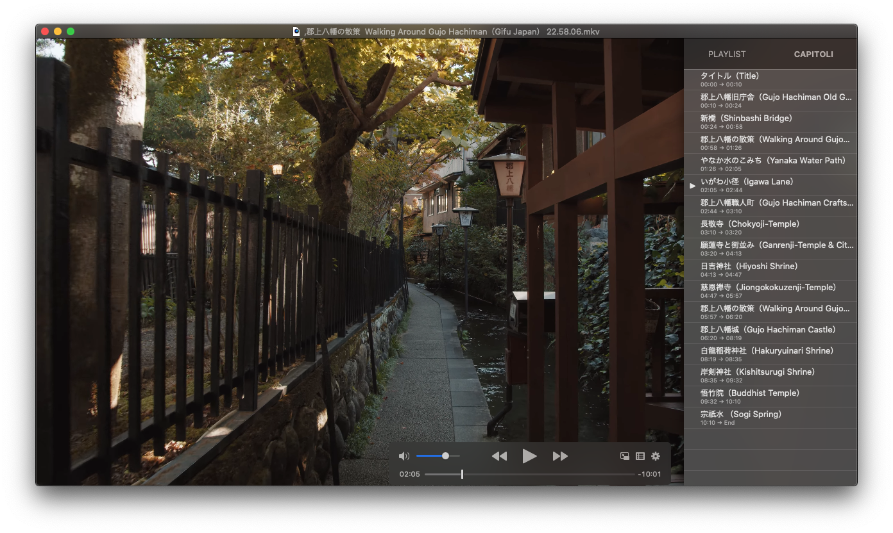

# YouTube w. Chapters Downloader

#### In the first half of 2020 YouTube introduced the option to add chapters to a progress bar.
> *Chapters break up your video into sections, each with an individual preview. These chapters can help viewers by giving more info and context by allowing them to rewatch different parts of the video.*

-
## Brief story

To date I haven't found a youtube downloader which also includes these chapters. I therefore decided to do it myself. The result is this script.

What it does is download the given video, search for chapters and feeds them in an .mkv file.

## Dependencies

This script uses `ffmpeg` to modify the downloaded video metadata and add the chapters.

## How to use

Download the script. 
Open a terminal window and run `python3 [pathToScript] [url]`. 
You can also directly run the script and insert the youtube url afterwards. 
Example: `python3 youtubeChaptersDownloader.py https://youtu.be/leR7cTpbvyA`

Once downloaded you can open the file and you should be able to see the chapters:

Note that this script only downlaods video which **do** have chapters.
